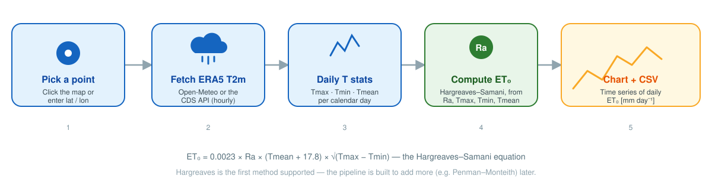

<p align="center">
  
</p>

<h1 align="center">Evapotranspiration Calculator</h1>
<p align="center"><b>QGIS plugin · daily ET&#8320; from ERA5 reanalysis data</b></p>

<p align="center">
  = 3.22">
  
  
</p>

Pick a point on the map, choose a date range, and get a daily **reference evapotranspiration (ET&#8320;)** time series — computed from ERA5 2 m temperature with the Hargreaves–Samani equation, charted in the dialog, and exportable to CSV. No API key required by default.

## Why "evapotranspiration", not "evaporation"

**Evaporation** is water loss from an open surface only. **Evapotranspiration** adds water lost through plant leaves (transpiration) — it's the quantity irrigation, crop-water-balance, and hydrology workflows actually need, and it's what ET&#8320; and the Hargreaves–Samani equation compute. The plugin is named accordingly, and built so more ET methods can sit alongside Hargreaves over time rather than being tied to one formula.

## Features

- 📍 Pick a point by clicking the map canvas or typing lat/lon directly
- 🛰️ Two data backends: **Open-Meteo** (instant, no key) or the **CDS API** (official Copernicus ERA5, needs a personal access token)
- 🔲 ERA5 / ERA5-Land grid overlay so you can see exactly which reanalysis cell your point snaps to
- 📈 Interactive daily ET&#8320; chart, plus one-click CSV export
- ❔ In-app Help button linking back to this documentation

## How it works

<p align="center">
  
</p>

```
ET₀ = 0.0023 × Ra × (Tmean + 17.8) × √(Tmax − Tmin)
```

`Ra` (extraterrestrial radiation) is derived from latitude and day-of-year; `Tmax`/`Tmin`/`Tmean` come from aggregating the downloaded hourly 2 m temperature into daily values.

## Data sources

| | Open-Meteo | CDS API |
|---|---|---|
| API key | Not required | Required ([register here](https://cds.climate.copernicus.eu)) |
| Speed | Instant | Slower (queued reanalysis requests) |
| Underlying data | ERA5 reanalysis (1940–present) | ERA5 reanalysis, official Copernicus source |
| Recommended for | Most users | Users who need the official CDS provenance |

Grid resolution can be switched between **ERA5-Land** (0.1° ≈ 11 km) and **ERA5** (0.25° ≈ 25 km).

## Requirements

- QGIS 3.22+
- Python packages available to QGIS's own Python (not necessarily your system Python): `numpy`, `pandas`, `matplotlib`. `numpy`/`pandas` usually ship with QGIS already; `matplotlib` isn't guaranteed to — if the plugin fails to load with `ModuleNotFoundError: No module named 'matplotlib'` (or `numpy`/`pandas`), install the missing one against QGIS's own interpreter, e.g. on Windows:
  ```
  "C:\Program Files\QGIS <version>\bin\python-qgis-ltr.bat" -m pip install matplotlib
  ```
  (that filename is `python-qgis.bat` instead of `python-qgis-ltr.bat` on a non-LTR release — check your QGIS `bin` folder; adjust the install path too. On Linux/macOS, run `pip install matplotlib` using whichever Python your QGIS install actually uses, not necessarily the system `python3`.)

## Installation

**From a release ZIP**
1. Download the latest `Evapotranspiration-Calculator-*.zip` from [Releases](https://github.com/iliasmachairas/Evapotranspiration-Calculator/releases) (or build one yourself — see below).
2. In QGIS: `Plugins → Manage and Install Plugins → Install from ZIP`, select the file, click **Install Plugin**.

**Building a release ZIP yourself**
```bash
./build_plugin.sh            # builds the zip and commits/pushes to git
./build_plugin.sh --no-git   # just builds the zip in ~/Downloads
```

## Usage

1. Click the **Evapotranspiration Calculator** toolbar icon (or find it in the Plugins menu)
2. *Settings* tab: pick a data source — Open-Meteo needs nothing further; CDS needs your API token pasted and saved
3. *Analysis & Results* tab: pick a point on the map (or type lat/lon), set a date range
4. Click **▶ Calculate ET₀** — results are charted automatically
5. Click **💾 Export CSV** to save the daily series

## Roadmap

Hargreaves–Samani is the first method implemented. The plugin name and structure intentionally leave room for additional evapotranspiration methods (e.g. Penman–Monteith) in future releases.

## Issues & contributions

Bug reports and feature requests: [issue tracker](https://github.com/iliasmachairas/Evapotranspiration-Calculator/issues).

## License

[GPL-3.0](LICENSE)
